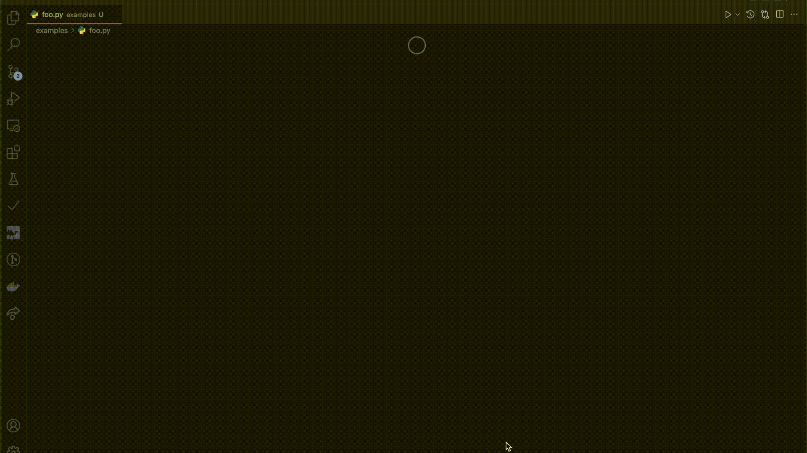

# Punched card

A Visual Studio Code extension for jokes that allows editing files using punched cards.

## Quick start

1. Install this extension
2. open a file

Once the extension is installed, the editing screen for all files becomes punched cards!

## Specifications

- Character code is ASCII code
- 1 character per column
- 40 characters per piece

It is also a specification that once a hole has been punched, it cannot be undone (It is not impossible to undone using VS Code's Undo).

## Development

1. `git clone git@github.com:ajfAfg/vscode-punched-card.git`
2. Open the cloned repository in VS Code
3. `npm install`
4. `npm run watch`
5. Press `F5`

### References

- [Cat Customs - Custom Editor API Samples](https://github.com/microsoft/vscode-extension-samples/tree/main/custom-editor-sample)
- [Your First Extension](https://code.visualstudio.com/api/get-started/your-first-extension)
- [Webview API](https://code.visualstudio.com/api/extension-guides/webview)
- [Custom Editor API](https://code.visualstudio.com/api/extension-guides/custom-editors)
- [Publishing Extensions](https://code.visualstudio.com/api/working-with-extensions/publishing-extension)

## License

MIT

## Award

- Awarded an [excellence award](https://twitter.com/geek_pjt/status/1556208824687947776?s=21&t=hvh0cHoG8oOvWvENKLaToQ) 🥈 at [GEEK CAMP vol.7](https://talent.supporterz.jp/events/3207890b-4b45-46f6-881b-e761a919cbe1/)
  - [Slide](https://docs.google.com/presentation/d/1nVPDaP2NIDpSD4t9t1G5rWlR-TO1aeHE7rgSF1ymygU/edit)
  - [Blog](https://ajfafg.github.io/giiku-camp-vol7-2022/)
